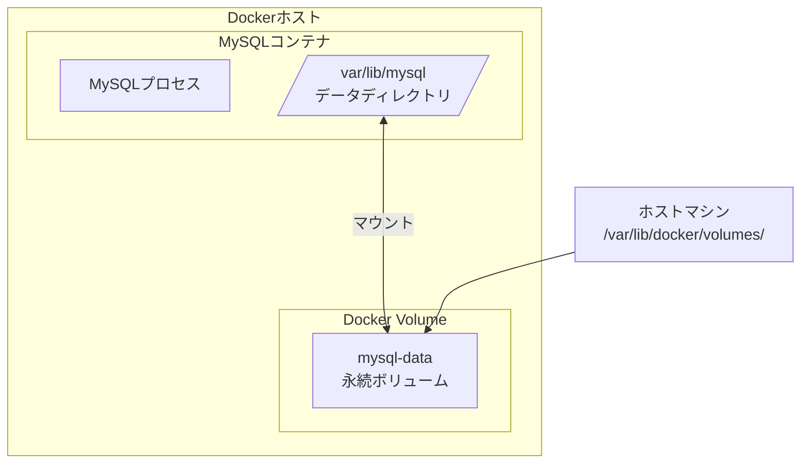
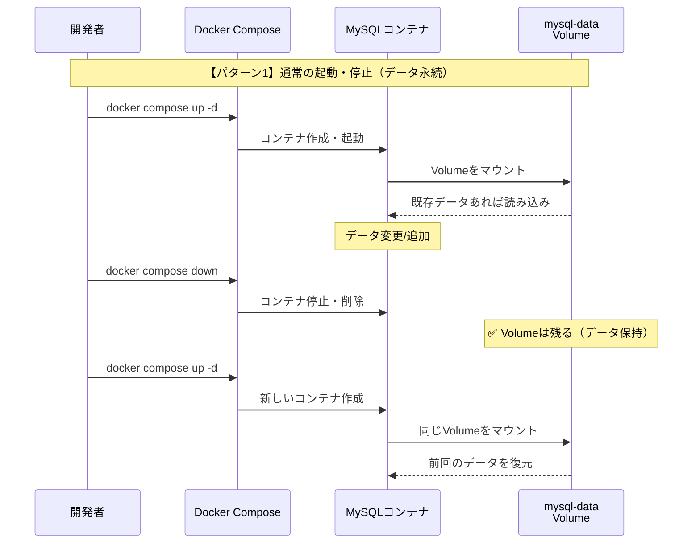
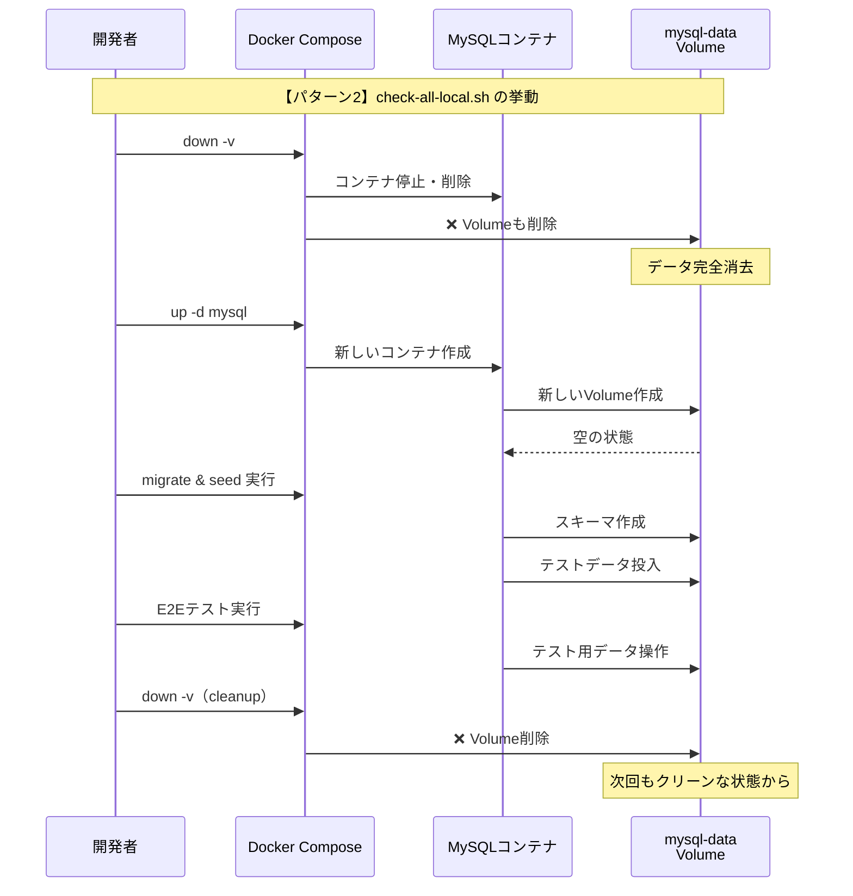

# ローカルDBの永続化仕様

## 概要

ローカル開発環境のMySQLデータは、Dockerの命名付きボリューム（Named Volume）によって永続化されています。

## Docker Volume の仕組み



**ポイント**: コンテナが削除されても、Volume `mysql-data` は残り続けるためデータが保持されます。

---

## コマンド別の挙動

| コマンド | コンテナ | Volume | データ | 用途 |
|----------|----------|--------|--------|------|
| `docker compose up` | 作成/起動 | 残る | **残る** | 開発時の起動 |
| `docker compose down` | 削除 | 残る | **残る** | 開発終了時 |
| `docker compose down -v` | 削除 | **削除** | **消える** | クリーン再構築 |
| `check-all-local.sh` | - | - | **毎回消える** | CI/セルフチェック |

---

## シーケンス図

### 通常の起動・停止（データ永続）



### check-all-local.sh の挙動



---

## 開発時の運用

### データを残したい通常の開発

```bash
# 起動
docker compose -f infra/compose/docker-compose.yml up -d

# 停止（データは残る）
docker compose -f infra/compose/docker-compose.yml down

# 再起動（前回のデータが残っている）
docker compose -f infra/compose/docker-compose.yml up -d
```

### データを完全に消したい時

```bash
# Volumeごと削除
docker compose -f infra/compose/docker-compose.yml down -v
```

---

## Volumeの確認方法

```bash
# Volume一覧表示
docker volume ls

# mysql-dataの詳細
docker volume inspect reddit-ai-digest_mysql-data

# Volumeを手動で削除したい時
docker volume rm reddit-ai-digest_mysql-data
```

---

## 関連ファイル

- [docker-compose.yml](../../infra/compose/docker-compose.yml) - Volume定義
- [check-all-local.sh](../../apps/api/scripts/check-all-local.sh) - CIスクリプト（`down -v`使用）
